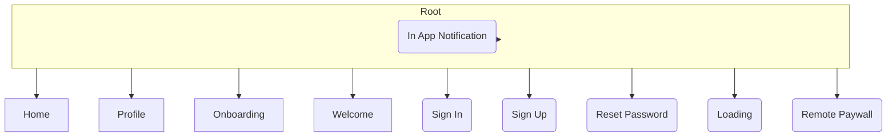

# App Structure

The app is represented by a set of components that are responsible for handling the logic of a given screen.

The Root Component is responsible for routing between components and passing the dependencies between them.

MobileStack ships with a predefined set of components to get you started as fast as possible.

:::tip

Instead of modifying existing components, you can clone them and modify the clone to your needs. This way you can keep easily update the original components when new versions are released.

:::

